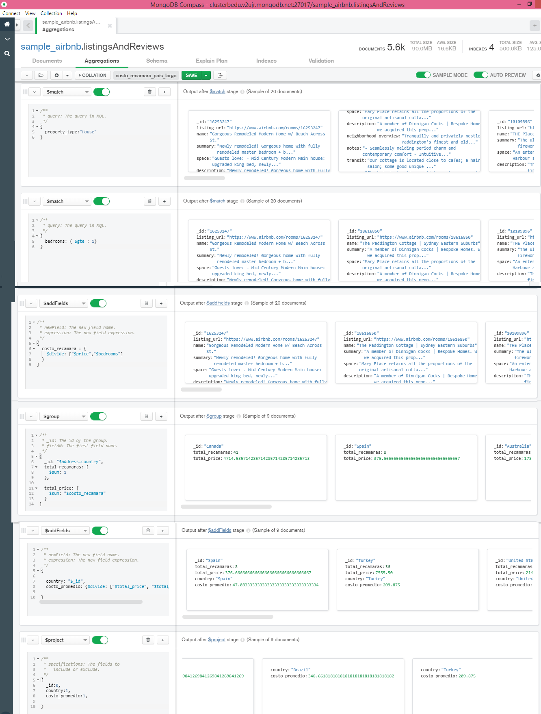
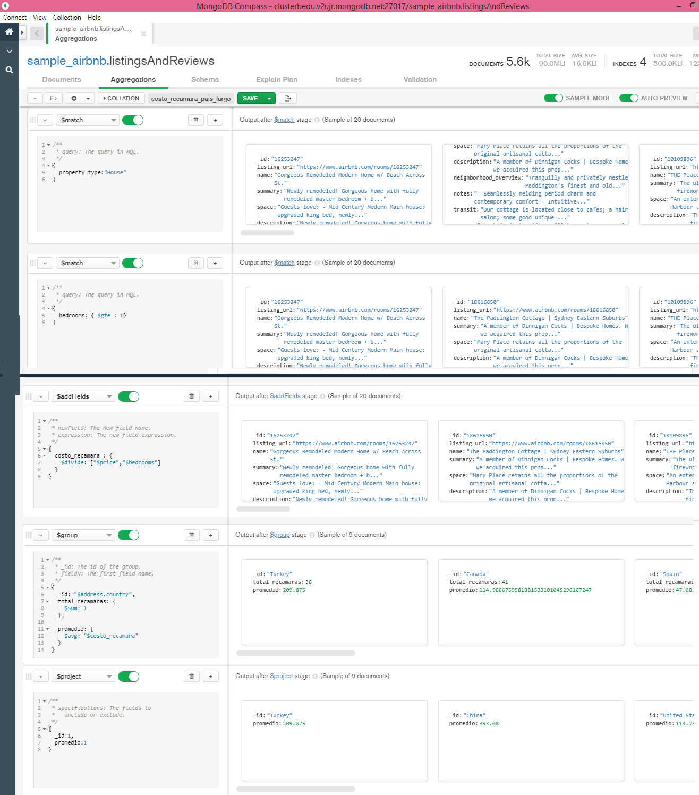
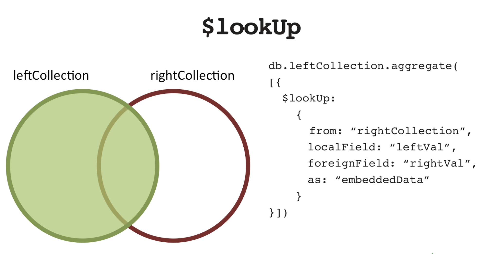

# Sesión 6 BEDU:Agregaciones MongoDB.

En MongoDB es posible realizar agregaciones mediante **$group** el cual agrupa los documentos input mediante una expresión **_ id** especificada y por cada agrupamiento, el output es un documento. El campo **_ id** de cada documento output contiene el valor de $group. 

De tal forma que una **agregación** nos permite aplicar una función a un *campo* de una *colección* en el caso de documentos de la misma forma que un **agrupamiento** lo hace con una *columna* en el caso de *tablas*. En **$group** necesitamos especificar el campo por el cual agrupar y posteriormente indicar uno por uno los acumuladores y a que columna o valor están aplicados. Mediante el formato siguiente:

```json
{
  $group:
    {
      _id: <expression>, // Group By Expression
      <field1>: { <accumulator1> : <expression1> },
      ...
    }
 }
```        
https://docs.mongodb.com/manual/reference/operator/aggregation/group/
        
Podemos pensar que el **acumulador** en MongoDB funge como las **funciones de agrupamiento** en el caso de MySQL.Recordando que para ello se hace uso de las variables categóricas al estas contar con un número determinado (finito) de opciones. en *field1* se hace referencia al nuevo campo en el cual se aplican los acumuladores correspondientes.

En el caso de **_ id :null** se agrupa a toda la colección entera, esto es, a todos los documentos de la colección.


## :pushpin: Reto 1. Agrupamientos. 
- Con base en el ejemplo 1, modifica el agrupamiento para que muestre el costo promedio por habitación por país de las propiedades de tipo casa. El ejercicio 1 visto en la sesión fue el siguiente: 
- Para ejemplificar el concepto de agrupamiento, buscaremos el costo promedio de una habitación de tipo casa, continuaremos usando la base de datos `sample_airbnb.listingsAndReviews`.

**:exclamation: NOTA** Al realizar operaciones aritméticas es importante que si estamos dividiendo nos aseguremos de **NO** operar con documentos cuyo valor sea cero. 
#### Camino largo ejercicio 1 solución al reto costo recámara-país.

#### Con el uso de $avg (Camino corto).

## :pushpin: Reto 2. Asociación de colecciones.
Mientras que en MySQL contábamos con la primitiva JOIN, en el caso de MongoDB se tiene **$lookUp** el cual es análogo a utilizar un **LEFT JOIN** en MySQL.



Imagen consultada en: Morgan, A. (2015, 30 octubre). Joins and Other Aggregation Enhancements Coming in MongoDB 3.2 (Part 1 of 3) – Introduction. MongoDB. https://www.mongodb.com/blog/post/joins-and-other-aggregation-enhancements-coming-in-mongodb-3-2-part-1-of-3-introduction . 


- Usando las colecciones `comments` y `users`, se requiere conocer el correo y contraseña de cada persona que realizó un comentario. Construye un pipeline que genere como resultado estos datos.

En este caso es necesario podemos utilizar como **localField:'name'** y **foreignField:'name'** sin embargo el campo nombre es más probable que se repita, por lo que es más conveniente utilizar el campo **email** para ambos.

## :pushpin: Reto 3. Generación de vistas.
De igual manera que con MySQL, en MongoDB es posible generar una colección virtual con los resultados de la cosulta, de tal forma que genera una colección con los resultados del *pipeline de una agregación*. Para generar una vista seleccionamos [Save] -> [Create a View] en la pestaña de `Aggregations` y le asignamos un nombre. La salida de la última capa es la vista. **NOTA:** Es necesario utilizar **$project** al final si desamos ver nuestras colecciones y documentos en la pestaña de **Documents**.

1. Usando el pipeline generado en el Reto 2, genera la vista correspondiente.

2. Para finalizar, elimina todas las vistas que generaste durante esta sesión. En la siguiente sesión, aprenderás a tener tu propio servidor para generar tus propias vistas. 
